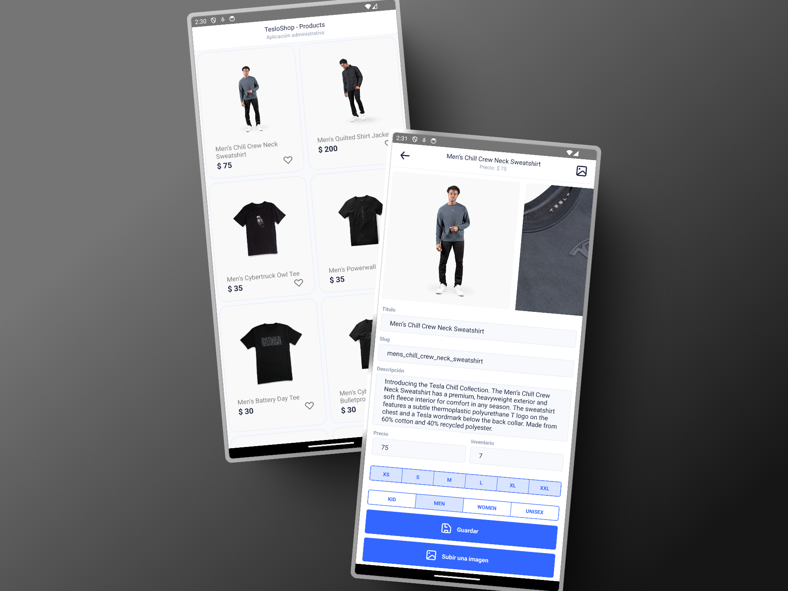

# 📱 React Native E-commerce App

Este es un proyecto desarrollado en **React Native** como parte del curso [React Native](https://cursos.devtalles.com/courses/react-native) dictado por **Fernando Herrera**. En este curso se enfoca en la implementación de autenticación, gestión de productos y manejo de imágenes en una aplicación de comercio electrónico.

## 🚀 Características

### 🔐 Autenticación

- Diseño de **Login y Registro** con validaciones.
- Manejo de autenticación con **JWT**.
- Verificación de usuario antes de acceder a la aplicación.
- Persistencia de sesión.

### 🛍️ Gestión de Productos

- Creación, actualización y eliminación de productos.
- Asociación de productos con el usuario que los creó.
- Manejo eficiente de datos con **TanStack Query** (useQuery, useMutation).
- Uso de **caché** para optimizar el rendimiento.
- Formularios con **Formik**.
- Componentes de UI con **UI Kitten**.

### 📸 Manejo de Imágenes

- Uso de la **cámara y la galería** para subir imágenes de productos.
- Procesamiento de imágenes: cambio de dimensiones y tamaño antes de subirlas al backend.

## 🖼️ Captura de Pantalla



## 🛠️ Tecnologías Utilizadas

- **React Native** (CLI)
- **TanStack Query** para manejo de datos
- **Formik** para formularios
- **UI Kitten** para el diseño de la interfaz
- **React Navigation** para la navegación
- **Expo ImagePicker** (si se usó Expo) o **react-native-image-picker**
- **AsyncStorage** para la persistencia de sesión
- **Axios** para las peticiones HTTP

## 📂 Estructura del Proyecto

```
📂 src
 ┣ 📂 components    # Componentes reutilizables
 ┣ 📂 screens       # Pantallas principales (Login, Registro, Home, Productos, etc.)
 ┣ 📂 hooks         # Hooks personalizados
 ┣ 📂 context       # Contexto de autenticación y otros estados globales
 ┣ 📂 services      # Llamadas a la API
 ┣ 📂 navigation    # Configuración de React Navigation
 ┗ 📜 App.js        # Punto de entrada de la aplicación
```

## 📦 Instalación y Uso

1. Clona el repositorio:
   ```sh
   git clone https://github.com/tu-usuario/nombre-del-repositorio.git
   cd nombre-del-repositorio
   ```
2. Instala las dependencias:
   ```sh
   npm install
   # o
   yarn install
   ```
3. Inicia la aplicación en un emulador o dispositivo:
   ```sh
   npx react-native run-android  # Para Android
   npx react-native run-ios      # Para iOS
   ```

## 📌 Notas

- Asegúrate de que el backend esté en ejecución antes de probar la autenticación y la gestión de productos.
- Si usas **Emulador de Android**, activa el modo desarrollador y verifica la conexión al backend.

## ✨ Contribución

Si deseas contribuir al proyecto, siéntete libre de hacer un **fork**, crear una **rama** y enviar un **pull request**.

## 📜 Licencia

Este proyecto se distribuye bajo la licencia MIT.

---

✉️ Para dudas o sugerencias, contáctame en [sutarabrenda@gmail.com]
